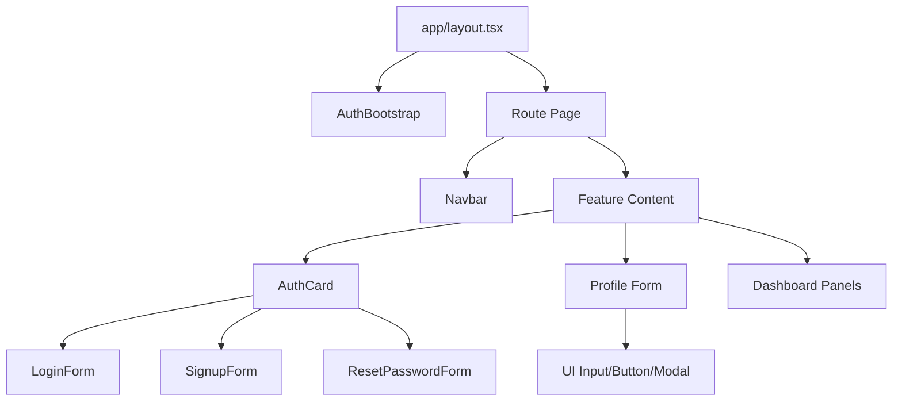

# Architecture Overview

## Folder Structure

```text
ONE PLACE PROJECT/
├── app/                     # App Router pages and layouts
│   ├── auth/                # Signup, login, reset password pages
│   ├── dashboard/           # Dashboard page
│   ├── profile/             # Profile page
│   ├── globals.css          # Global Tailwind styles
│   └── layout.tsx           # Root layout and app providers
├── pages/api/               # Backend API routes (Node runtime)
│   ├── auth/                # Auth endpoints (signup, login, me, logout, reset)
│   └── user/                # User endpoints (profile read/update)
├── components/
│   ├── forms/               # Connected form components
│   ├── providers/           # App-level client providers/bootstrapping
│   └── ui/                  # Reusable UI component library
├── lib/                     # Shared backend/frontend utilities
│   ├── auth/                # JWT, password, auth guard helpers
│   ├── validators/          # Zod request payload validation
│   ├── api-handler.ts       # API wrapper with method checks/errors/logging
│   ├── api-client.ts        # Frontend fetch wrapper
│   ├── db.ts                # Prisma client singleton
│   ├── env.ts               # Environment config and validation
│   ├── errors.ts            # Custom API error class
│   └── logger.ts            # Structured logging helper
├── prisma/
│   ├── schema.prisma        # Data model
│   └── migrations/          # SQL migrations
├── store/                   # Global client state (Zustand)
├── __tests__/               # Jest + RTL tests
├── docs/                    # Architecture and API documentation
└── .github/workflows/       # CI pipelines
```

## Component Hierarchy



## Data Flow

1. User submits form in `components/forms/*`.
2. Form calls `lib/api-client.ts` (`apiRequest`) to hit `/pages/api/*` endpoints.
3. API routes validate payloads with Zod and process domain logic.
4. Database operations run through Prisma (`lib/db.ts` + `prisma/schema.prisma`).
5. Auth routes sign JWT and set HttpOnly cookie; frontend also keeps user state in Zustand.
6. Protected endpoints call `requireAuth` to verify token from header or cookie.
7. Proxy (`proxy.ts`) protects `/dashboard` and `/profile` routes by validating JWT cookie.

## Backend Request Pipeline

```text
HTTP Request
  -> createApiHandler (method validation + error handling + logging)
  -> payload validation (zod)
  -> service logic (auth/db)
  -> response serialization
```
